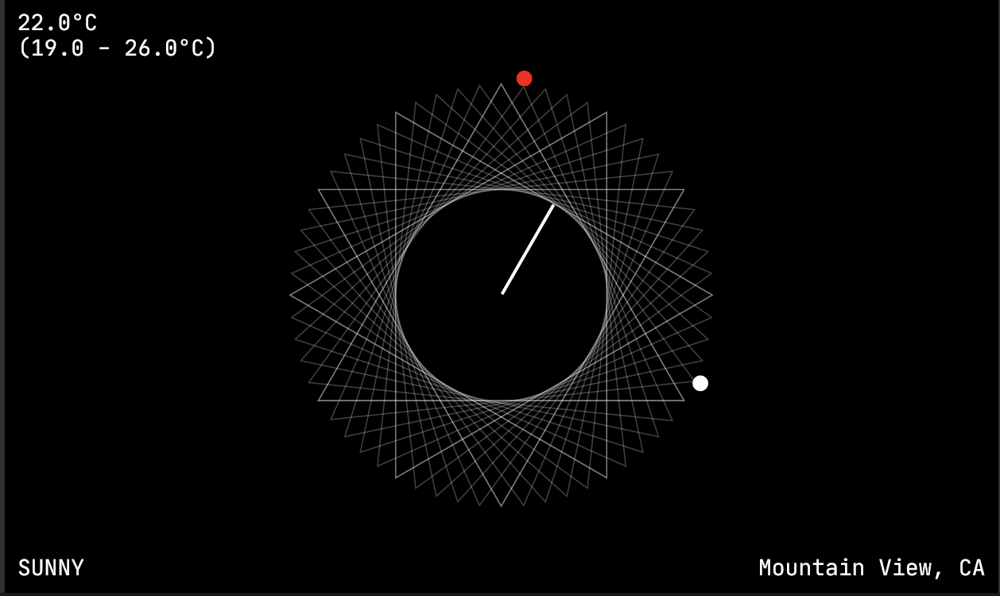
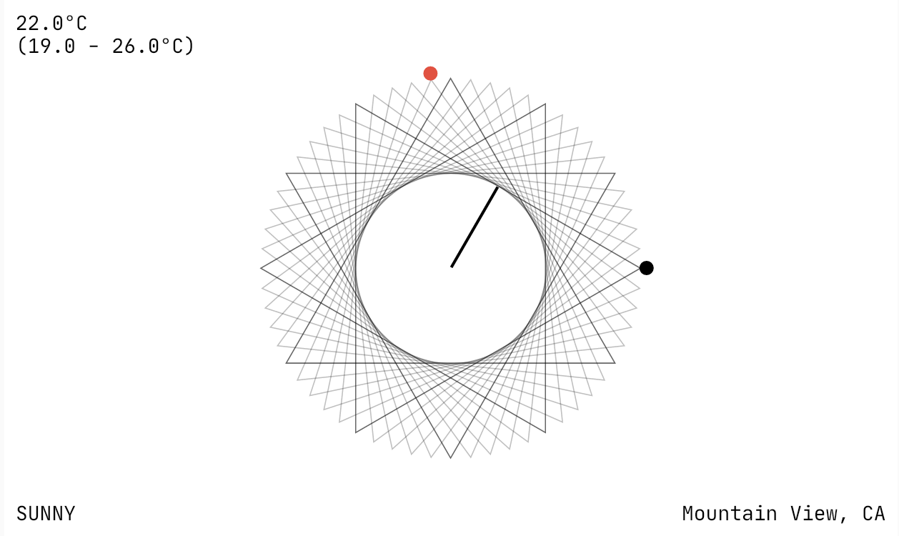

# Analog Clock

Buil upon the Google analog clock. This app runs an analog clock with
geometric figures and some basic colors. The hour indicator always marks one of these. It has a light theme and a dark theme with colors that change over time and displays some data in the JetBrains Mono font.

